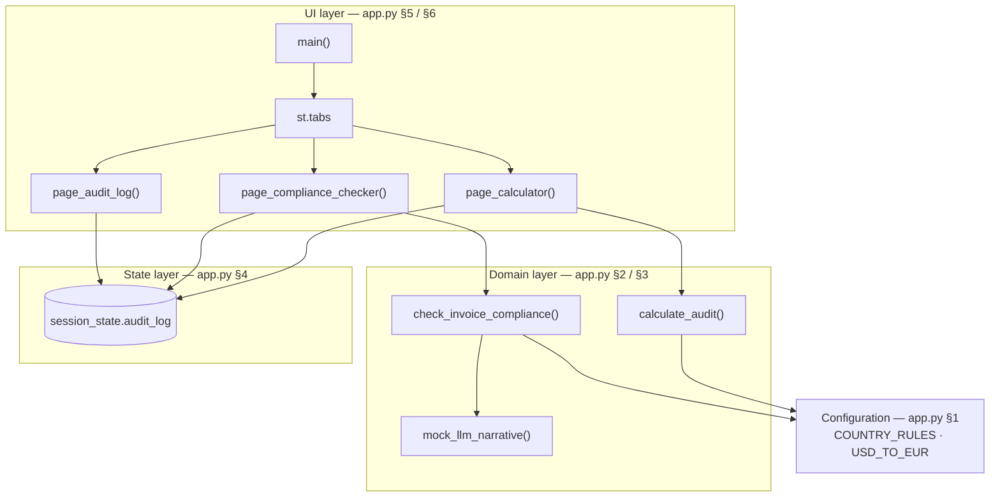

<div align="center">

# 🌍 Global Billing & Invoice Compliance Auditor

**A Streamlit mini-MVP for global payroll billing, employer-cost estimation, and invoice-compliance auditing.**

[](https://github.com/SergeyGer/global-billing-auditor/actions/workflows/ci.yml)
[](LICENSE)
[](https://www.python.org/downloads/)
[](https://streamlit.io/)
[](https://github.com/astral-sh/ruff)
[](CONTRIBUTING.md)

</div>

---

## Overview

The **Global Billing & Invoice Compliance Auditor** is a self-contained, reproducible
[Streamlit](https://streamlit.io/) application that models the last mile of global payroll billing:
estimating the employer cost of an invoice, flagging compliance gaps in raw invoice text, and keeping a
queryable audit trail of everything that was reviewed.

It is designed as a **product-shaped demo** — the workflow, terminology, and risk model mirror how a
global employment platform (EOR / contractor management / payroll) reasons about cross-border billing,
rather than a production system. Everything is deterministic and runs locally with two dependencies.

> **Simulated data notice:** FX rates, fee percentages, and VAT/social-contribution rates are
> illustrative fixtures for demonstration. They are **not** live rates and **not** tax or legal advice.

## Table of Contents

- [Key Features](#key-features)
- [Screenshots](#screenshots)
- [How It Works](#how-it-works)
- [Architecture](#architecture)
- [Tech Stack](#tech-stack)
- [Getting Started](#getting-started)
- [Configuration](#configuration)
- [Project Structure](#project-structure)
- [Testing](#testing)
- [Roadmap](#roadmap)
- [Contributing](#contributing)
- [License](#license)
- [Disclaimer](#disclaimer)

## Key Features

| # | Module | What it does |
|---|--------|--------------|
| 1 | **Invoice Audit Calculator** | Simulates employer cost, platform compliance fee, employer social contributions, and tax/VAT for an invoice, based on the selected country (US, UK, Germany) and worker type (Contractor / Full-time). |
| 2 | **AI Invoice Compliance Checker** | Audits raw invoice text against jurisdiction-specific rules (e.g. missing USt-IdNr. for German B2B, missing W-8BEN/W-9 for US contractors, unclear UK VAT registration) and returns severity-ranked findings plus a deterministic mock-LLM summary. |
| 3 | **Asynchronous Audit Log** | A filterable, exportable audit trail that records every calculation and compliance check, with KPI tiles, faceted filters, and CSV export. |

### Highlights

- **Multi-country cost model** for the US, UK, and Germany with worker-type-aware social contributions.
- **Demo FX conversion** so all totals can be normalised to USD and shown back in the user's currency.
- **Rule engine + mock LLM narrative** — fully deterministic, so demos and tests are reproducible.
- **Severity-ranked findings** (`high` / `medium` / `low`) that map directly to remediation priorities.
- **Polished dark theme** delivered by a self-contained CSS layer — no external design system required.

## Screenshots

| AI Invoice Compliance Checker | Asynchronous Audit Log |
|---|---|
|  |  |

## How It Works

1. **Estimate cost** — Choose a country, worker type, currency, and invoice amount. The calculator
   converts to USD, applies the country's compliance-fee rate and (for full-time workers) the employer
   social-contribution rate, and returns an all-in employer cost plus an effective load percentage.
2. **Audit invoice text** — Paste raw invoice text (OCR output or an email body). The rule engine infers
   the likely jurisdiction, checks structural fields and tax identifiers, and returns prioritised findings.
3. **Review the trail** — Every run is appended to the in-session audit log, which can be filtered by
   country, status, risk level, and source, and exported to CSV.

## Architecture

The application is a **single-file Streamlit app** ([`app.py`](app.py)) organised into five labelled
layers. Each layer is readable in isolation, and the domain logic is pure Python — which is why it can be
unit-tested without a running Streamlit server.

### Layered blocks

```text
┌────────────────────────────────────────────────────────────┐
│ LAYER 1 · ENTRY POINT                                      │
│ main()                                                     │
│ st.set_page_config() · APP_CSS · init_session_state()      │
└────────────────────────────────────────────────────────────┘
                             │
                             ▼
┌────────────────────────────────────────────────────────────┐
│ LAYER 2 · UI (Streamlit tabs)                              │
│ page_calculator() · page_compliance_checker()              │
│ page_audit_log()                                           │
└────────────────────────────────────────────────────────────┘
                             │
                             ▼
┌────────────────────────────────────────────────────────────┐
│ LAYER 3 · DOMAIN LOGIC                                     │
│ calculate_audit() · to_usd() / from_usd()                  │
│ check_invoice_compliance() · mock_llm_narrative()          │
│ AuditBreakdown · ComplianceFinding  (dataclasses)          │
└────────────────────────────────────────────────────────────┘
                             │
                             ▼
┌────────────────────────────────────────────────────────────┐
│ LAYER 4 · STATE                                            │
│ seed_audit_log() · append_audit_row()                      │
│ st.session_state['audit_log'] · ['audit_seq']              │
└────────────────────────────────────────────────────────────┘
                             │
                             ▼
┌────────────────────────────────────────────────────────────┐
│ LAYER 5 · CONFIGURATION                                    │
│ COUNTRY_RULES · USD_TO_EUR                                 │
│ APP_TITLE · APP_TAGLINE · APP_CSS                          │
└────────────────────────────────────────────────────────────┘
```

### Module map

| Block | `app.py` section | Key names | Responsibility |
|---|---|---|---|
| **Configuration** | §1 CONFIG & THEME | `APP_TITLE`, `USD_TO_EUR`, `COUNTRY_RULES`, `APP_CSS` | Single source of truth for demo rates, FX, and theming. |
| **Domain logic** | §2 Invoice Audit Calculator | `AuditBreakdown`, `to_usd`, `from_usd`, `calculate_audit` | Pure-function employer-cost model — no Streamlit imports needed to test it. |
| **Domain logic** | §3 AI Compliance Checker | `ComplianceFinding`, `check_invoice_compliance`, `mock_llm_narrative`, `_has_*` rule helpers | Jurisdiction inference, regex rule checks, severity ranking, deterministic narrative. |
| **State** | §4 Asynchronous Audit Log | `seed_audit_log`, `append_audit_row`, `init_session_state` | In-session DataFrame store that mimics an async audit queue. |
| **UI** | §5 UI Pages | `render_header`, `render_metric_card`, `render_finding`, `page_*` | One render function per tab; formatting only, no business logic. |
| **UI** | §6 Main | `main` | Page config, CSS injection, sidebar, tab wiring. |

### Data flow



Every audit — whether it comes from the calculator or the compliance checker — is normalised into one
row (`audit_id`, `country`, `amount`, `status`, `risk_level`, `source`) before it is written to the state
layer, so the audit log stays the single reporting surface.

## Tech Stack

- **Language:** Python 3.10+
- **UI / runtime:** [Streamlit](https://streamlit.io/)
- **Data:** [pandas](https://pandas.pydata.org/)
- **Quality:** [pytest](https://docs.pytest.org/) · [Ruff](https://github.com/astral-sh/ruff) · GitHub Actions

## Getting Started

### Prerequisites

- Python **3.10+**
- `pip` (or any virtual-environment manager)

### Installation

```bash
# 1. Clone the repository
git clone https://github.com/SergeyGer/global-billing-auditor.git
cd global-billing-auditor

# 2. Create and activate a virtual environment
python -m venv .venv

#   Windows (PowerShell)
.venv\Scripts\Activate.ps1
#   macOS / Linux
source .venv/bin/activate

# 3. Install dependencies
pip install -r requirements.txt
```

### Run

```bash
streamlit run app.py
```

The app opens automatically at <http://localhost:8501>.

## Configuration

All tunable demo parameters live at the top of [`app.py`](app.py):

| Setting | Location | Description |
|---|---|---|
| Demo FX rate | `USD_TO_EUR` | Static USD → EUR conversion used to normalise totals. |
| Country rules | `COUNTRY_RULES` | Per-country compliance-fee, VAT, and employer social rates plus compliance notes. |
| Theme | `.streamlit/config.toml` | Streamlit theme overrides that complement the in-app CSS. |

To change a rate, adjust `COUNTRY_RULES` or `USD_TO_EUR` and reload the app.

## Project Structure

```text
global-billing-auditor/
├── .github/
│   ├── ISSUE_TEMPLATE/            # Bug & feature issue forms
│   ├── workflows/ci.yml           # Lint + test CI pipeline
│   ├── PULL_REQUEST_TEMPLATE.md
│   ├── dependabot.yml             # Automated dependency updates
├── .streamlit/config.toml         # Streamlit theme / server config
├── tests/test_app.py              # Unit tests for the core logic
├── app.py                         # Single-file application
├── pyproject.toml                 # Project metadata, pytest & Ruff config
├── requirements.txt               # Runtime dependencies
├── requirements-dev.txt           # Development dependencies
├── Makefile                       # Common developer tasks
├── global-billing-auditor.code-workspace
├── Screenshot 1 - AI Checker.jpg  # README screenshots
├── Screenshot 2 - Audit Log.jpg   # README screenshots
├── README.md
├── CHANGELOG.md
├── CONTRIBUTING.md
├── CODE_OF_CONDUCT.md
├── SECURITY.md
├── LICENSE
├── .editorconfig
└── .gitignore
```

## Testing

The core logic is covered by unit tests that do not require a running Streamlit server.

```bash
pip install -r requirements-dev.txt
pytest          # run the test suite
ruff check .    # run the linter
```

Or, where `make` is available:

```bash
make test
make lint
```

## Roadmap

This project ships as a complete mini-MVP. The following is the intended direction of travel;
priorities are indicative and may shift.

### Next

- [ ] Replace the mock LLM narrative with a real provider integration (OpenAI / Anthropic) behind a feature flag.
- [ ] Source FX rates from a live provider with caching and graceful fallback.
- [ ] Add input validation and structured error handling to the invoice parser.
- [ ] Enforce a test-coverage threshold in CI.

### Later

- [ ] Persist the audit log in a real datastore (PostgreSQL) with migrations.
- [ ] Move audit execution to an asynchronous worker queue (Celery / RQ + Redis).
- [ ] Add authentication and role-based access (Reviewer / Approver / Admin).
- [ ] Generate downloadable PDF audit reports.

### Exploring

- [ ] Extend the rule engine to additional jurisdictions and configurable tax profiles.
- [ ] Expose a REST API and outbound webhooks for downstream billing systems.
- [ ] Multi-tenant workspaces with per-tenant policy configuration.
- [ ] Observability: structured logging, metrics, and audit-trail integrity checks.

## Contributing

Contributions, issues, and feature requests are welcome. Please read
[CONTRIBUTING.md](CONTRIBUTING.md) and our [Code of Conduct](CODE_OF_CONDUCT.md) before opening a
pull request. For security issues, see [SECURITY.md](SECURITY.md).

## License

Released under the [MIT License](LICENSE).

## Disclaimer

This project is a demonstration prototype. The fees, tax, VAT, and compliance rules it models are
**simplified and illustrative** and do **not** constitute tax, legal, or accounting advice. Do not use
it to make real billing or compliance decisions without validation by qualified professionals.

---

<div align="center"><sub>Built with Streamlit · Simulated data only · Not tax or legal advice</sub></div>
